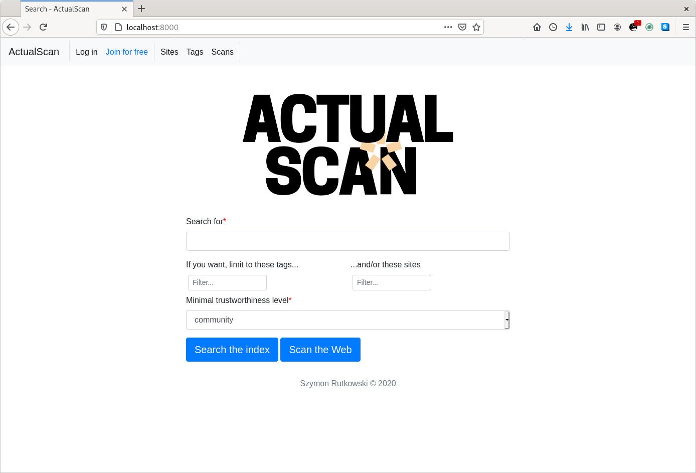
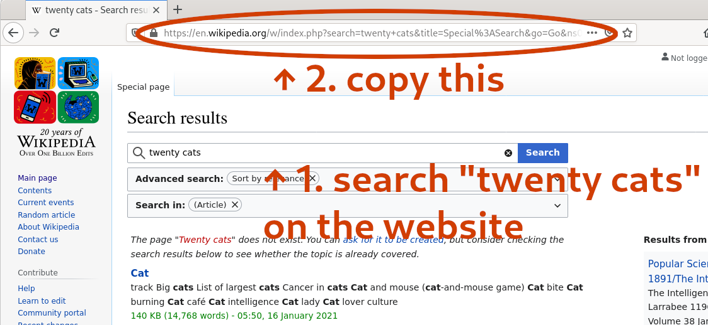

# Table of contents
1. Introduction
2. Technical overview:
  - architecture
  - setup instructions
  - testing
  - debugging
3. How to use your install!
4. Contributing and communications

# Introduction
ActualScan is a smart (analytic) Web search engine with infinitely sortable results. It focuses on informative and niche
websites, online discussions and articles. It's good for exploring what people have to say about any topic.
Read more on the visions for [social indexing](https://tech.actualscan.com/posts/social-indexing/)
and [analytic results](https://tech.actualscan.com/posts/analytic-results/) on the blog.

ActualScan is free software (AGPL v3): you can run your own instance and review and modify the code, as long
as you also make the source available to users.

Currently indexing should work decently on many Wordpress sites, some media and forums sites, and Reddit
(optional: you have to use your own [Reddit API key](https://www.reddit.com/wiki/api)).

The project is still in a *very early* stage! Stay tuned for a public alpha server.
You can follow the [blog](https://tech.actualscan.com/) with the email newsletter or RSS.
Also see the **contributing** info at the end.

# Technical overview

Under the hood ActualScan is a bunch of services written in Python, Java and some Common Lisp. The whole stack is
provided with two orchestration schemes, Docker Compose and Ansible.

Docker Compose is intended for testing and developing ActualScan code on your local machine. We try to
include as much of production-like network security (TLS etc.) as possible, to test that everything works,
but overall this version is not intended for serious production use.

The Ansible version, on the other hand, should offer a relatively plug-and-play experience where you
provide your servers and get a search engine. Due to some recent serious changes in the stack,
and apparently changes in RedHat's CentOS support guarantees, this is currently *not up to date*.
*It is possible to go fully Ansible in the future, but then we would require using virtual machines for local development*.

**Important note**: *only* for sites' search pages, the crawler ignores robots.txt (the unofficial standard for telling crawlers
what to crawl). This is unlikely to get you into any trouble  if you play with ActualScan casually on a local machine:
but consider yourself warned. In the future there will be config option to disable this. This is done because website owners
are likely not to predict our use case when blocking robots specifically from their search pages. (Search pages are useless
for most existing crawlers and search engines.) If sites (also) block their *content* pages from robots, we won't save or index them anyway.

## List of services (architecture overview)

A guide to exploring the code if you want. The list goes by the Docker Compose container names.

- **Website**: a Django project, at `python_modules/ascan`. The `scan` package (app) contains the main search interface and classes for
controlling crawling/scanning process. The `manager` package contains user interface for managing sites, tags and other entities.
The `bg` package is for everything else, like user profiles, autocomplete etc. *This partitioning scheme isn't ideal, but a replacement
would have to be clearly better and for the long term*.
- **Maintenance** daemon: a constant worker supervising scans (starting, finishing...), sending WebSocket updates etc. The code is in
`python_modules/ascan/maintenance.py`
- **Speechtractor**: a Lisp HTTP service used by the crawler. Gets raw HTML, extracts parsed text, URLs, author info and such. The code
is in `lisp/speechtractor`.
*The continued use of Common Lisp is not certain. It has been already abandoned for Omnivore; the reasoning with pros and cons may
appear on the blog at some point.*
- **Omnivore2**: a Python service used by the crawler and working on the index in the background. It gets the articles,
parses them with [spaCy](https://spacy.io/), splits them into a-couple-sentences chunks loosely called 
"[periods](http://dcc.dickinson.edu/grammar/latin/structure-period)", and applies various text analytics. The texts are then
annotated with this info in Solr and it can be used freely for sorting results. The code lives in `python_modules/omnivore2`.
- A **[StormCrawler](https://stormcrawler.net/)-based crawler** (the zookeeper, nimbus and other Storm cluster members):
this does the actual crawling and fetching pages with reasonable politeness. The process is tightly controlled and monitorable
from the website through objects stored in PostgreSQL. The relevant Storm topology code lives in `java/generalcrawl`.
*There used to exist a convoluted Scrapy spider for this which became unworkable. Not all functionality has been ported, which is a
big priority now*.
- **Redditscrape**: a [PRAW](https://praw.readthedocs.io/en/latest/)-based script, working continuously in parallel to the
regular Web crawler. It uses Reddit API instead of HTML scraping. The code is in `python_modules/ascan/reddit_scraper.py`.
- The **[Selenium](https://www.selenium.dev/)** instance. This is needed for parsing pages relying on JavaScript,
especially search pages. *Currently not used because the relevant crawler code needs to be ported from the old Scrapy spider.*
- The databases: **Solr** for storing and searching web pages, **Redis** for some ephemeral flags and data used by Python code,
**PostgreSQL** for everything else.

## Setting up the Docker Compose version

Sorry that this is a longish, somewhat manual process. **If you're not sure what you're doing, don't!**
The experience should be gradually improved when the project matures.

1. These instructions are written for Linux, but everything we use is cross-platform. Install Docker and Docker Compose.
You will also need OpenSSL, JDK 11+ and Apache Maven installed.
2. Clone this repository. Make a copy of the `.env.sample` file and name it `.env`.
3. Open that file and follow instructions, setting up passwords, secrets etc. for the services. Never
reuse those in production!
4. Create the self-signed SSL certificates for communications between services.
(These are different from public-facing certs you would use when putting ActualScan on the Web.)
In each case use **the same** passphrase that you set as `KEYSTORE_PASSWORD` variable in your `.env` file.
From the `certs/dev` directory run:
```bash
openssl req -x509 -newkey rsa:4096 -keyout ascan_dev_internal.pem -out ascan_dev_internal.pem \
-config openssl.cnf -days 9999
# Make a copy of the key without the passphrase:
openssl rsa -in ascan_dev_internal.pem -out ascan_dev_internal_key.key
openssl pkcs12 -export -in ascan_dev_internal.pem -inkey ascan_dev_internal.pem \
-out ascan_dev_ssl_internal.keystore.p12 -name "ascan-solr"
```
5. Compile the Java package with the crawler topology. From `java/generalcrawl` run:
```bash
mvn compile
mvn package
```
6. Now you can build the services with `docker-compose build` in the main repo directory.
7. Before starting the website, perform necessary database migrations like so.
The last command will walk you through creating the admin account.
```bash
docker-compose run website python manage.py makemigrations scan
docker-compose run website python manage.py makemigrations manager
docker-compose run website python manage.py makemigrations bg
docker-compose run website python manage.py makemigrations
docker-compose run website python manage.py migrate
docker-compose run website python manage.py createsuperuser
```
8. Finally, you can issue the `docker-compose up` command. Your local ActualScan instance is now up and running!

**Troubleshooting**
- If you paste the first OpenSSL command and it does nothing (says `req: Use -help for summary.`), try
retyping it manually. See [here](https://serverfault.com/questions/1021663/creating-csr-for-ssl-request-on-ubuntu-gives-error#comment1326408_1021666)
for a similar problem.
- If you use and enforce SELinux, the containers may have problems with reading from disk inside them. The
usual symptom is Python complaining about unimportable modules. You can change the rules appropriately
by running `chcon -Rt svirt_sandbox_file_t .` (probably as sudo) in the project directory.
- Storm and the `nimbus` container can crash after restarting if you don't run `docker-compose down` after
stopping everything. You probably have to run `docker-compose down` before running `docker-compose up` again.

## Running tests and some tips for debugging

### On Docker Compose

You can run all existing tests in the containers with `bash run-tests-docker-compose.sh`. The containers need
to be up. Python services use [pytest](https://docs.pytest.org/en/latest/contents.html), Common Lisp tests are
scripted with the [fiasco](https://github.com/joaotavora/fiasco) package.

- If you want to dig into some failing tests with `pdb` in one container,
`docker-compose exec website pytest -x --pdb` can be useful (in this case for the `website` service).
- To plug directly into the PostgreSQL console, use `docker-compose exec postgres psql -U <your-postgres-username>`.
- To get more logs from the `redditscrape` service, change `-L INFO` in its entry in  `docker-compose.yml`
to `-L DEBUG`. For `omnivore2` this is controlled by the `--log-level=debug` (you may replace `debug` with `info` etc.)
parameter.
- You sometimes can also see more logs from a service with `docker-compose logs <container_name>`.
- Use the Storm UI available at `http://localhost:8888`. There you inspect the configuration, the `crawl` topology,
change its log level and so on.
- To directly inspect the Storm topology (crawler) logs, modify this snippet. The exact directory changes depending
on the timestamp when the crawler topology started.
```bash
docker-compose exec storm_supervisor ls /logs/workers-artifacts
docker-compose exec storm_supervisor cat /logs/workers-artifacts/crawl-1-<THIS PART CHANGES>/6700/worker.log
```

# How to use your install
After following the setup instructions you can navigate to the website address (`localhost:8000` for the
Docker Compose version) in your browser. You will see something like this:

*Search the index* button searches the already indexed pages. *Scan the Web* button scans the selected sites
(and/or sites with selected tags) for the query phrase. But for now, you have no tags or sites in your database.
Let's change that.

Login to the admin account that you created (you may also register a new user, if you configured email properly).
Go to the *Tags* tab on the website. Create some tags that you want to classify sites with: for example
*technology*, *news* etc.

Now go to the *Sites* tab and click *Add a new site*. The way ActualScan does selective crawling is by making
use of the sites' own search function. (You can also just crawl them traditionally, this will be ported soon.)
You normally add sites by typing `twenty cats` into **their** search box, then clicking on *Search* or an
equivalent button on **their** website. Then copy the URL from your browser to the *Add site* form in
the ActualScan interface.

Because ActualScan performs smart text extraction and analysis, not all websites will be succesfully crawled.
The number of them will be increasing with improvements in the crawler and Speechtractor. For now,
you can try these websites:
- `https://www.cnet.com/search/?query=twenty+cats`
- `https://www.newscientist.com/search/?q=twenty+cats&search=&sort=relevance`
- `https://www.reuters.com/search/news?blob=twenty+cats`
- `https://www.tomshardware.com/search?searchTerm=twenty+cats`

You can also add subreddits (if you configured Reddit API in `.env`).

The interface should be able to guess the site's homepage address for you. Select one of the content types
(blog, forums, media, social) -- this is used by Speechtractor to guide the text and metadata extraction.
Select at least one tag for the website. Click *Add the site*.

After adding the sites you can return to the ActualScan homepage. Type your query (for example *curiosity*)
into the search box and click on *Scan the Web* button. This will create a new scan and take you to its monitoring
page. You can wait for the scan to finish, or click *Search the index now* even while it's still working.

Once you have more than 10 results for a query, custom ranking comes into play. Use the sliders to the right
to change the scoring rules in real time. For example, *mood* refers to positive/negative sentiment detected
in the text. You can set minimal and maximal value for a parameter, and adjust its weight (if you set a higher
weight, text fragments with higher values of the parameter will come to the top).

Click on *Add rule* at the bottom of the slider column to name and add the rule permanently
to your ActualScan installation. You can also edit, copy, paste and share the rule strings next to that
button, such as `sl,*,*,2;wl,9,*,5;awtf,*,0.4,2;neg,*,0.35,0;pos,*,0.45,0`.

# Contributing and communications
- Please do not submit patches/pull requests without talking about it first.
- Main needs and plans for the project are communicated with GitHub issues.
- Your opinions and suggestions are very kindly welcome! (Agreement not guaranteed though 🙃)
- Currently the main channel **for suggestions** is email (see below) or GitHub issues. We will think of opening a mailing list
and/or a IRC/Matrix room *(or something different but open and reasonable)* if there's a need for it.
- Get in touch especially if you use, or seriously want to use, the software: **write an email** to contact@actualscan.com.
Do communicate your needs, so they can be taken into account in new features and you can get info on important changes.
(Note that this is *only* good will and best effort, as ActualScan is currently developed completely for free.)
